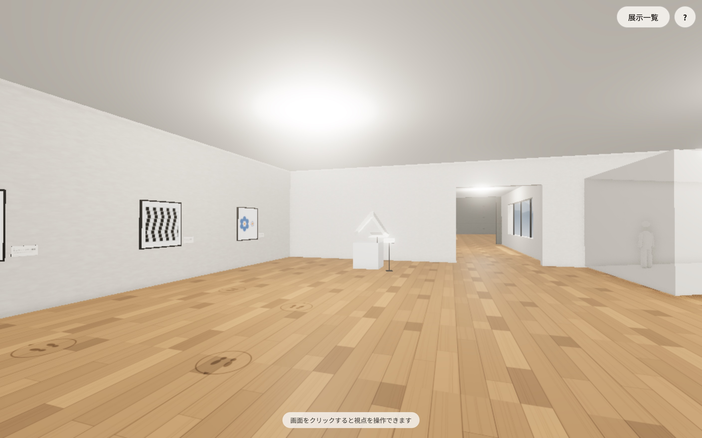
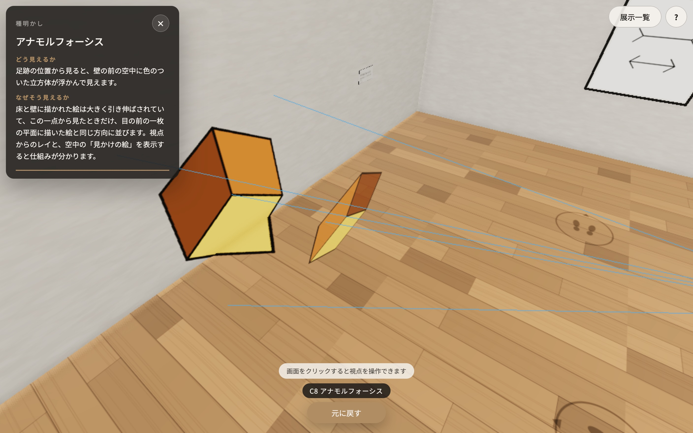

# Fable 5.1製 Optical Illusion Museum (錯視美術館)

生成AIモデルの空間把握性能を探るために作った技術検証プロジェクト




- Claude Fable 5.1
  - 実装計画書 : high
  - 実装 : xhigh

## 遊べるページ

https://maoku.github.io/Fable51OpticalIllusion/

### 現行

- マウス操作とブラウザフォーカスがかちあうので、ヒント表示は Eキー がおすすめ
- 錯視として成立していない展示があります

## 過去のシリーズ

- Opus 5 : https://github.com/Maoku/Opus5OpticalIllusion
- Fable 5 : https://github.com/Maoku/FableOpticalIllusion
- GPT-5.6 Sol https://github.com/Maoku/GPT56SolOpticalIllusion

# Optical Illusion Museum

ブラウザで歩き回れる 3D の錯視ミュージアムです。古典錯視を正確に再現した「古典の間」と、視点・光・空間の操作でしか成立しない Fable オリジナル展示を集めた「Fable の間」の 2 室を、回廊で結んでいます。

各展示には「ヒント」があり、初期状態では非表示です。展示に近づくと現れるボタンを押すと、テキストの解説と 3D 上の演出で種明かしが行われ、もう一度押すと元の見え方に戻ります。

- 公開版: <https://maoku.github.io/Fable51OpticalIllusion/>(ブラウザだけで遊べます)
- 計画: [Docs/IMPLEMENTATION_PLAN.md](Docs/IMPLEMENTATION_PLAN.md)
- 推奨視点のスクリーンショット: [Docs/screenshots/](Docs/screenshots/)
- クレジット: [CREDITS.md](CREDITS.md)

## 操作方法

|          | PC                                           | モバイル                               |
| -------- | -------------------------------------------- | -------------------------------------- |
| 移動     | W A S D / 矢印キー(Shift で早歩き)           | 画面の左半分に触れてスティックを傾ける |
| 見回す   | マウス(クリックで視点操作を開始、Esc で解除) | 画面の右半分をドラッグ                 |
| ヒント   | E キー、または「ヒントを見る」ボタン         | 「ヒントを見る」ボタン                 |
| 展示一覧 | Tab キー、または右上の「展示一覧」           | 右上の「展示一覧」                     |
| 操作説明 | 右上の「?」                                  | 右上の「?」                            |

PointerLock が使えない環境(一部のブラウザや埋め込み表示)では、ドラッグで視点を回す方式に自動で切り替わります。

## 展示

### 古典の間

| #   | 展示                 | 種別                                                |
| --- | -------------------- | --------------------------------------------------- |
| C1  | エイムズの部屋       | 視点依存(覗き窓から直方体に見える台形の部屋)        |
| C2  | ペンローズの三角形   | 視点依存(足跡の位置からだけ閉じて見える 3 本の角柱) |
| C3  | チェッカーシャドウ   | 3D 再現(A と B は同じ色)                            |
| C4  | ミュラー・リヤー錯視 | 2D ポスター                                         |
| C5  | カフェウォール錯視   | 2D ポスター                                         |
| C6  | エビングハウス錯視   | 2D ポスター                                         |
| C7  | くぼんだ顔           | 視点依存(凹面の顔が凸に見える)                      |
| C8  | アナモルフォーシス   | 視点依存(床と壁の歪み絵が空中の立方体に見える)      |

### Fable の間・回廊

| #   | 作品           | 概念                                                     |
| --- | -------------- | -------------------------------------------------------- |
| F1  | 三面の彫刻     | 正面は円、側面は正方形、真上は三角形に見える一つの立体   |
| F2  | 傾きの間       | 12° 傾いた部屋。球が坂を登り、鉛直な人形が傾いて見える   |
| F3  | 色の部屋       | 均一な光で奥行きが消え、同じ灰色の板が別の色に見える     |
| F4  | 窓の外の庭     | 回廊の窓の向こうの広大な水庭は、3 m 先の 1/20 のジオラマ |
| F5  | 無限の井戸     | 深さ 30 cm の井戸が底なしに見える(ポータル描画)          |
| F6  | 終わらない階段 | 登り続けても同じ踊り場に戻る塔の階段                     |
| F7  | 逆さの水面     | 水面に映る反射が本物と違う形をしている                   |

## ローカルで動かす

Node.js 22.12 以上が必要です(`.nvmrc` に記載。`nvm use` で切り替えられます)。

```bash
npm ci
npm run dev
```

`http://localhost:5173` を開きます。

### URL パラメータ(デバッグ用)

| パラメータ                      | 内容                                               |
| ------------------------------- | -------------------------------------------------- |
| `?quality=high` / `mid` / `low` | 品質ティアを固定する                               |
| `?stats=1`                      | fps・ティア・描画回数などの統計を左下に表示する    |
| `?timescale=3`                  | 時間を早送りする(描画の遅い環境で演出を確認する用) |
| `?demo=1`                       | 演出パターン確認用の仮展示を Fable の間に追加する  |

## テスト

```bash
npm run lint        # ESLint と Prettier
npm test            # Vitest(幾何計算、近接判定、入力、コンテンツの整合など)
npm run build       # 型チェックとビルド
npm run test:e2e    # Playwright(起動、移動、ヒントの開閉、ワープ、階段の継ぎ目)
npm run licenses    # 依存パッケージのライセンス確認
npm run credits     # credits.ts から CREDITS.md を再生成
```

推奨視点のスクリーンショットを撮り直すには:

```bash
SHOTS=1 npx playwright test screenshots --project=desktop-chromium
```

特定の展示だけなら `SHOTS=ames-room,penrose-triangle`、任意の位置からなら `SHOT_POSES="name:x,z,yaw,pitch"` を指定します。

## 実機での確認

1. PC とスマホを同じ Wi-Fi に繋ぎ、`npm run dev` を実行します(`vite.config.ts` で `host: true` にしてあるので LAN からアクセスできます)。
2. 起動時に表示される `Network:` の URL をスマホのブラウザで開きます。
3. `?stats=1` を付けると fps とティアが表示されます。目標は iOS Safari / Android Chrome で 30fps 以上です。fps が出ない場合は pixelRatio が自動で下がり、それでも足りなければティアが 1 段下がります。
4. 確認する項目: 仮想スティックでの移動、ドラッグでの見回し、ヒントボタンの押しやすさ、F2「傾きの間」と F6「終わらない階段」の中を歩けること、F5「無限の井戸」を覗き込んだときの見え方。

## デプロイ(GitHub Pages)

公開先は <https://maoku.github.io/Fable51OpticalIllusion/> です。`deploy.yml` は `main` への push で自動的に走り、公開版が更新されます。任意のタイミングで公開し直したいときは、Actions タブから「Deploy to GitHub Pages」を選んで「Run workflow」を実行します(`gh workflow run deploy.yml --ref main` でも同じです)。

Settings → Pages の Source は「GitHub Actions」に設定済みです。ワークフローがリポジトリ名を `BASE_PATH` に渡してビルドし、`https://<owner>.github.io/<repo>/` に公開します。ビルドが失敗した場合は公開されず、直前のサイトが残ります。

公開時と同じサブパスでローカル確認するには、`BASE_PATH=/Fable51OpticalIllusion/ npm run build` の後に `npx vite preview --base /Fable51OpticalIllusion/` を実行します。

CI(`ci.yml`)は push と PR で lint・ライセンス確認・単体テスト・ビルド・E2E を実行しますが、Pages への書き込み権限は持ちません。デプロイとは独立に走るため、`main` への push では両方が並行して動きます。

## 構成

- `src/app/` レンダラ・ループ・品質ティア・ポストプロセス
- `src/input/` キーボード・マウス・タッチ入力の抽象化
- `src/player/` 一人称の移動とコリジョン
- `src/museum/` 部屋・回廊・天窓・マテリアル・光源の間引き
- `src/exhibits/` 展示の基底クラス、ヒント演出の部品、古典の間と Fable の間の各展示
- `src/procedural/` テクスチャ・図版・立体の手続き生成
- `src/ui/` HUD、ヒントパネル、展示一覧、操作説明、クレジット
- `src/content/` 展示の文言とクレジット

技術的な方針は [Docs/IMPLEMENTATION_PLAN.md](Docs/IMPLEMENTATION_PLAN.md) を参照してください。
